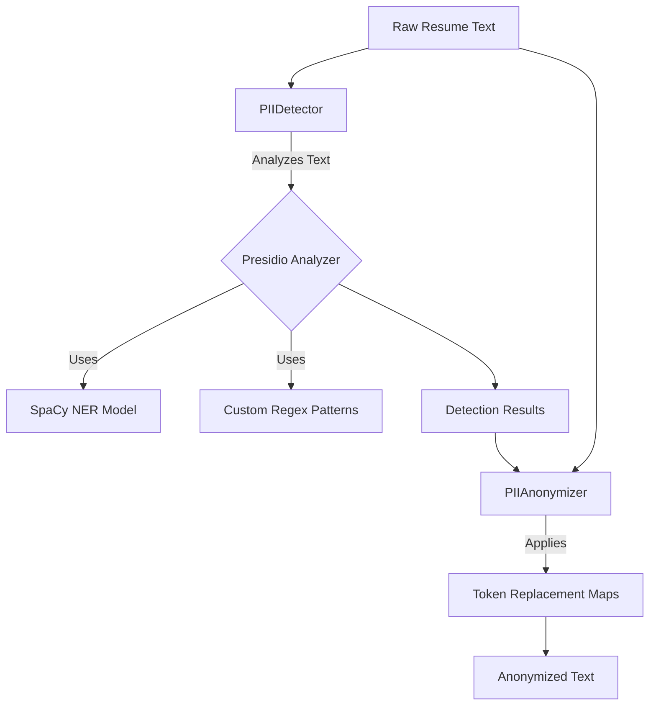

# System Architecture

## Overview
The Resume Anonymization System is designed as a modular pipeline that ingests raw resume text, processes it to detect personally identifiable information (PII), and outputs an anonymized version.

## Pipeline Components

### 1. Detection Layer (`anonymizer.detector.PIIDetector`)
The detection layer is responsible for scanning the input text and identifying PII entities.
- **Engine**: Microsoft Presidio Analyzer
- **Model**: `en_core_web_lg` (SpaCy) for Named Entity Recognition (NER).
- **Custom Recognizers**:
    - `POLISH_ID`: Regex-based detection for Polish ID numbers.
    - `TIME`: Regex-based detection for time formats.
- **Output**: A list of `RecognizerResult` objects containing:
    - Entity Type (e.g., `PERSON`, `EMAIL`)
    - Start/End indices
    - Confidence Score

### 2. Anonymization Layer (`anonymizer.anonymizer.PIIAnonymizer`)
The anonymization layer takes the raw text and the detection results to produce the final output.
- **Strategy**: Token Replacement (e.g., `<PERSON>` -> `[NAME]`).
- **Engine**: Microsoft Presidio Anonymizer.
- **Operators**: configured to replace detected entities with standardized tokens defined in `anonymizer.anonymizer.PIIAnonymizer.TOKEN_MAPPING`.

### 3. CLI / Interface (`inference/anonymize_resume.py`)
The user interface is a command-line script that orchestrates the data flow:
1. Load Input File
2. Initialize Detector & Anonymizer
3. Run Detection
4. Run Anonymization
5. Write Output File

## Data Flow Diagram

